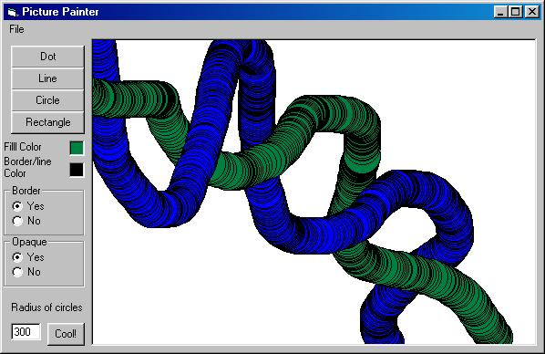



## Picture Painter

### Description

the purpose of this code is to have the abilities to make a graphic editor
 
### More Info
 

             |
---                |---
**Submitted On**   |2000-11-23 02:26:08
**By**             |[Paul Bergman](https://github.com/Planet-Source-Code/PSCIndex/blob/master/ByAuthor/paul-bergman.md)
**Level**          |Beginner
**User Rating**    |4.0 (8 globes from 2 users)
**Compatibility**  |VB 5\.0, VB 6\.0
**Category**       |[Graphics](https://github.com/Planet-Source-Code/PSCIndex/blob/master/ByCategory/graphics__1-46.md)
**World**          |[Visual Basic](https://github.com/Planet-Source-Code/PSCIndex/blob/master/ByWorld/visual-basic.md)
**Archive File**   |[CODE\_UPLOAD1196311232000\.zip](https://github.com/Planet-Source-Code/paul-bergman-picture-painter__1-13039/archive/master.zip)

